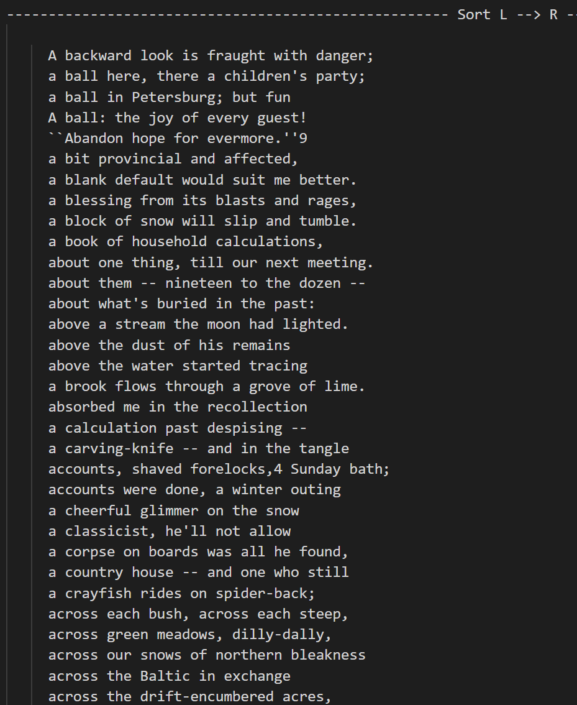
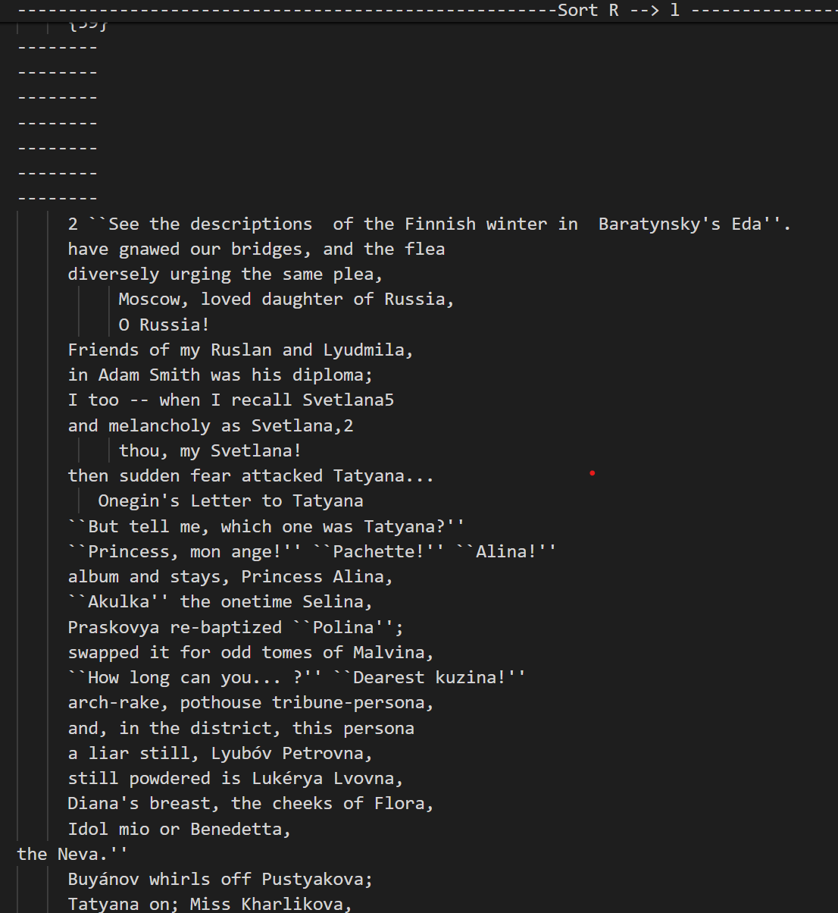

# Onegin 
This project was created to sort alphabetically (by the beginning and end of the lines) the text of the famous Russian writer Alexander Sergeevich Pushkin

## 
- [Technologies](#technologies)
- [Strart working](#start-worcing)
- [Sorting demonstration](#start-worcing)
- [Progect team](#progect-team)

## Technologies
- [C](https://www.w3schools.com/c/c_intro.php)
- [C++](https://www.w3schools.com/cpp/cpp_intro.asp)
- [GCC](https://gcc.gnu.org/)


## Usage
In order to use my project, it needs to be uploaded to the development environment, preferably VS code. To compile the project, you need a Linux operating system or WSL (Windows Subsystem for Linux) installed. Enter into the console....
```sh
$ make
```

### Requirements
To install and run the project, you need [Linux](https://www.linux.org/) for make.

## Sorting demonstration





## Project team
- [Evdokimov Dmitriy](https://t.me/Ev_dima) — chief developer
- [Dedinskiy Ilia](https://vk.com/ded32_ru) — team leader
- [Jitnikov Andrei](https://t.me/azhkov) — mentor, editor